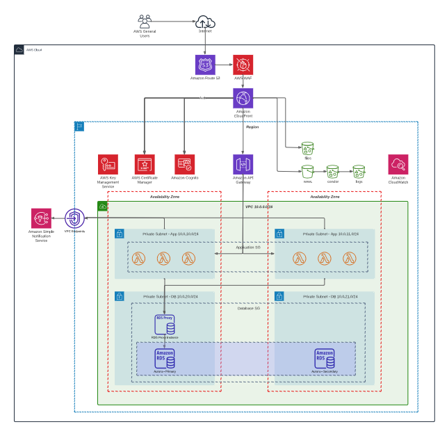

# aws-condor

The best neighborhood overwatch application. 

## Arquitectura actualizada del con las consideraciones de la catedra

Para usar el bucket de files para subir y obtener imágenes y videos vamos a utilizar presigned urls
https://aws.amazon.com/blogs/compute/patterns-for-building-an-api-to-upload-files-to-amazon-s3/

## Descripción de Módulos Utilizados

1. api_gateway: Configuración y gestión del AWS API Gateway.
2. api_gateway_endpoint: Automatiza la creación de todos los endpoints necesarios en base a la definición de la api provista.
3. cognito: Gestiona la configuración de AWS Cognito, que es un servicio de autenticación.
3. frontend: Se encarga de la configuración relacionada con el frontend.
4. lambda: Gestiona las funciones Lambda de AWS.
5. dynamo: Crea una tabla de dynamo con hash y scan key.
5. logging: Configura y gestiona los registros y monitorización.
6. security_group: Facilita la creación de un security group con sus recursos de ingress y egress rules.
7. vpc, vpc_endpoint (externo): Configura la VPC y sus recursos asociados, además de agregar los vpc endpoint para la comunicación entre servicios.
8. sns (externo): Gestiona la creación de un tópico en SNS

## Lista de componentes a evaluar

1. Lambda
2. VPC 
3. API Gateway
4. S3
5. Cognito
6. DynamoDB

## Funciones y meta-argumentos utilizados 

### Funciones
1. flatten
   - Se usa para transformar la definición de endpoints de la api, aplanando los métodos http e insertándoles su endpoint correspondiente.
2. filebase64sha256
   - Usada para proveer un hash del source code a la lambda.
3. length
   - Usada junto con count para generar los recursos de ingress y egress rules de los security groups.
4. cidrsubnet
   - Para dividir el cidr de la vpc entre las subnets

### Meta-argumentos
1. for_each
   - Utilizada en varios módulos para generar recursos en base a definiciones más simples y entendibles. Un ejemplo es definir la api como una lista de endpoints, que transformamos a mapas para generar todos los recursos necesarios.
2. count
    - Para generar los recursos de ingress y egress rules de los security groups.
3. depends_on
   - Para resolver dependencias entre recursos, un ejemplo es el caso del deploy del api gateway, el cuál depende de la creación de los endpoints 

## Diagrama de arquitectura implemenatada

## Rúbrica

<table>
    <tr>
        <th>Alumno</th>
        <th>Legajo</th>
        <th>Participación</th>
    </tr>
    <tr>
        <td>Galarza, Agustín</td>
        <td>61481</td>
        <td>25%</td>
    </tr>
    <tr>
        <td>Benvenuto, Agustín</td>
        <td>61448</td>
        <td>25%</td>
    </tr>
    <tr>
        <td>Estevez, Franco</td>
        <td>61452</td>
        <td>25%</td>
    </tr>
    <tr>
        <td>Brave, Jerónimo</td>
        <td>61053</td>
        <td>25%</td>
    </tr>
</table>